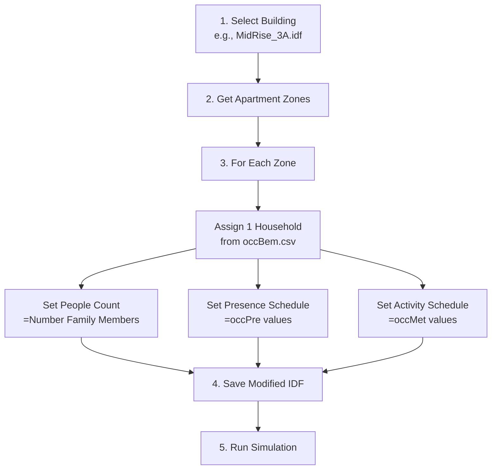

# Occupancy-BEM Integration Implementation Plan

Integrate classified occupancy data (occBem.csv) with EnergyPlus BEM simulations.

---

## Case Study Workflow

**Example: MidRise Apartment Building**



**Per-Zone Modification:**
| IDF Field | Source |
|-----------|--------|
| `Number of People` | `Number Family Members` |
| `Number of People Schedule Name` | Generated from `occPre` |
| `Activity Level Schedule Name` | Generated from `occMet` |

> [!IMPORTANT]
> Each household is assigned to **exactly one zone** and never reused.

---

## Data Source

**File:** `occupancy/samples/occBem.csv`

| Column | Description |
|--------|-------------|
| `Household_ID` | Unique household identifier |
| `hour` | Hour of day (0-23) |
| `occPre` | Presence fraction (0.0-1.0) |
| `occMet` | Metabolic rate (Watts) |
| `months_season` | 1-4 (Winter/Spring/Summer/Fall) |
| `week_or_weekend` | 1-3 (Weekday/Saturday/Sunday) |
| `Region` | 1-5 → Climate zone mapping |
| `Number Family Members` | People count for zone |
| `Room Count` | Room count reference |

**Resolution:** 12 schedules per household (4 seasons × 3 day types)

---

## Schedule Generation Strategy

### High-Resolution EnergyPlus Schedules

Generate `Schedule:Compact` with full seasonal and day-type variation:

```
Schedule:Compact,
    OCC_HH_123,                    !- Name
    Fraction,                      !- Type
    Through: 2/28,                 !- Winter
    For: Weekdays,
    Until: 1:00, 0.95,
    Until: 8:00, 0.87,
    ...
    For: Saturday,
    Until: 1:00, 1.0,
    ...
    For: Sunday,
    Until: 1:00, 1.0,
    ...
    Through: 5/31,                 !- Spring
    For: Weekdays,
    ...
```

### Mapping

| `months_season` | EnergyPlus Period | Date Range |
|-----------------|-------------------|------------|
| 1 (Winter) | Through: 2/28 | Jan-Feb |
| 2 (Spring) | Through: 5/31 | Mar-May |
| 3 (Summer) | Through: 8/31 | Jun-Aug |
| 4 (Fall) | Through: 12/31 | Sep-Dec |

| `week_or_weekend` | EnergyPlus Day Type |
|-------------------|---------------------|
| 1 | Weekdays |
| 2 | Saturday |
| 3 | Sunday |

---

## Implementation Phases

### Phase 1: Baseline Simulation
- Run default IDF simulation
- Store results for comparison

### Phase 2: Schedule Generator

#### [NEW] [occ_utils/schedule_generator.py](file:///Users/orcunkoraliseri/Desktop/BEMsetupOCC/occ_utils/schedule_generator.py)

```python
def generate_schedule_compact(household_df, schedule_name, schedule_type='Fraction'):
    """
    Generate Schedule:Compact from household data.
    
    Args:
        household_df: DataFrame for one household (288 rows = 12 schedules × 24 hours)
        schedule_name: e.g., "OCC_HH_123"
        schedule_type: 'Fraction' for occPre, 'Any Number' for occMet
    
    Returns:
        str: Schedule:Compact IDF text
    """
```

### Phase 3: Household-Zone Matching

#### [NEW] [occ_utils/household_matcher.py](file:///Users/orcunkoraliseri/Desktop/BEMsetupOCC/occ_utils/household_matcher.py)

```python
def match_households_to_zones(occbem_df, idf_zones):
    """
    Assign households to apartment zones.
    
    Strategy:
    1. Filter by Region → Climate zone
    2. Unique assignment: each household used ONLY ONCE
    3. Track used households to prevent reuse
    
    Returns:
        dict: {zone_name: household_id}
    """
```

> [!IMPORTANT]
> **Unique Assignment Rule**: Once a household schedule is assigned to a zone, it is marked as "used" and will not be assigned to any other zone.

### Phase 4: IDF Modification

#### [NEW] [bem_utils/idf_occupancy_modifier.py](file:///Users/orcunkoraliseri/Desktop/BEMsetupOCC/bem_utils/idf_occupancy_modifier.py)

Modify People objects:
- `Number of People Schedule Name` → Generated occupancy schedule
- `Number of People` → `Number Family Members`
- `Activity Level Schedule Name` → Generated activity schedule

### Phase 5: Compare Results

#### [NEW] [bem_utils/results_comparator.py](file:///Users/orcunkoraliseri/Desktop/BEMsetupOCC/bem_utils/results_comparator.py)

- Daily energy demand line charts
- Default vs Modified comparison
- Seasonal breakdown

---

## File Structure

```
BEMsetupOCC/
├── main_BEM.py                     # Add comparison options
├── occ_utils/
│   ├── schedule_generator.py       # [NEW]
│   └── household_matcher.py        # [NEW]
├── bem_utils/
│   ├── idf_occupancy_modifier.py   # [NEW]
│   └── results_comparator.py       # [NEW]
├── occupancy/samples/
│   └── occBem.csv                  # Input data (12 schedules/HH)
└── SimResults/
    ├── default/
    └── modified/
```

---

## Verification

1. Schedule syntax validation (EnergyPlus parseable)
2. Simulation runs without errors
3. Visual comparison of daily energy profiles
